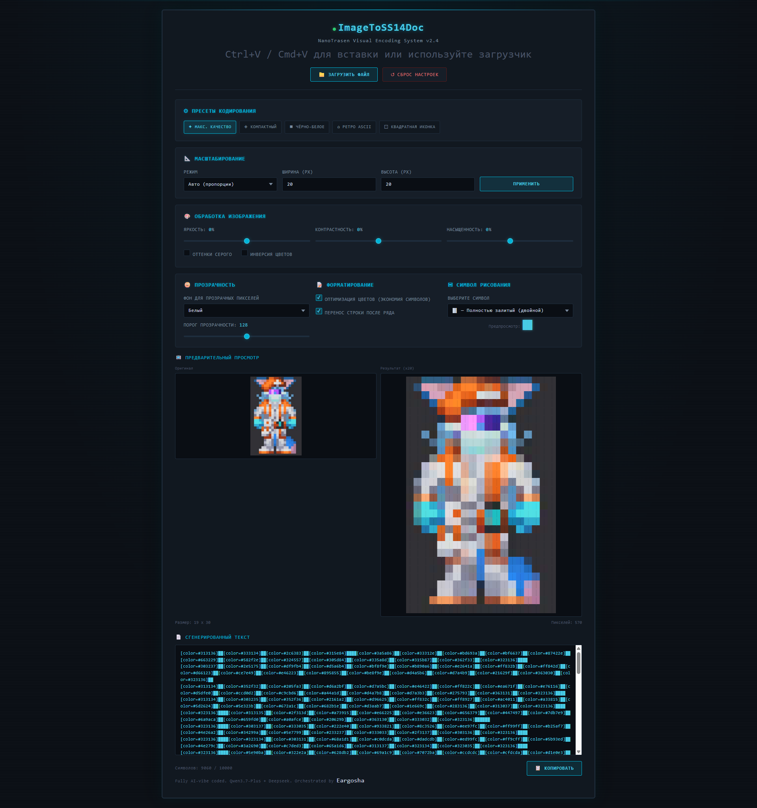

# 🛰️ ImageToSS14Doc

> *NanoTrasen Visual Encoding System v2.4*

Небольшой веб-инструмент для конвертации изображений в текст с BBCode-разметкой `[color=...]`, пригодный для вставки в игровые текстовые сообщения (документы, книги, записки и т.д.) в **Space Station 14**.

Загружаете картинку → настраиваете масштаб и обработку → получаете текст, который можно вставить прямо в игру.

---

## 📖 О проекте

Это инструмент **для генерации текстовых сообщений в игре Space Station 14**. Он превращает изображение в набор "пиксельных" символов, каждый из которых раскрашен через BBCode-тег `[color=#RRGGBB]`, — таким образом картинку можно "нарисовать" прямо в игровом документе или бумажке.

Тестирование проводилось **только на серверах Мёртвого Космоса** — на других серверах поддержка BBCode могут отличаться.

---

## 📸 Скриншот

---

## 🚀 Установка и запуск

Никакой сборки и зависимостей не требуется — это чистый HTML/CSS/JS файл.

**Вариант 1. Просто в браузере**
1. Скачайте файл `index.html`.
2. Откройте его двойным кликом в любом современном браузере (Chrome, Firefox, Edge).
3. Готово — можно пользоваться.

**Вариант 2. Через Live Server / Five Server в VS Code**
1. Откройте папку проекта в VS Code.
2. Установите расширение [Five Server](https://marketplace.visualstudio.com/items?itemName=yandeu.five-server) (или Live Server).
3. Кликните правой кнопкой по `index.html` → **Open with Five Server**.
4. Страница откроется в браузере с автообновлением при изменении кода.

Любой другой способ раздать статический HTML-файл (например, `npx serve`, `python -m http.server`) тоже подойдёт.

---

## 🎨 Возможности

- Загрузка изображения через кнопку или вставка из буфера обмена (`Ctrl+V` / `Cmd+V`)
- Пресеты кодирования: максимальное качество, компактный режим, чёрно-белый, ретро-ASCII, квадратная иконка
- Настройка масштабирования (авто, фиксированная ширина/высота/размер)
- Коррекция яркости, контрастности, насыщенности, оттенки серого, инверсия
- Настройка обработки прозрачности (цвет подложки или пропуск пикселя)
- Выбор символа для отрисовки пикселя (█, ▓, ▒, ░, ●, ◆ и др.)
- Автоматическая оптимизация вывода (склейка одинаковых цветов подряд), чтобы уложиться в лимит символов
- Предпросмотр результата и живой счётчик символов

---

## ⚠️ Ограничения

- **Лимит символов.** Игровые поля ввода (документы, книги, таблички) имеют ограничение на количество символов — инструмент старается уложиться в разумный лимит (~10000 символов), но на очень крупных/детализированных изображениях качество придётся уменьшать.
- **Не все сервера любят "взрослый" контент.** Это не инструмент для 18+ картинок как таковой, но результат — это просто набор цветных пикселей, и в невыгодном стечении обстоятельств (случайное сходство с чем-то нежелательным, шум/артефакты при сильном сжатии и т.п.) можно нарваться на бан по правилам сервера. Загружайте и публикуйте только то, за что готовы нести ответственность по правилам конкретного сервера.
- **Совместимость BBCode.** Формат `[color=#RRGGBB]` должен поддерживаться движком чата/документов сервера — на серверах с иной системой разметки текст может отобразиться некорректно.
- **Тестировалось только на серверах Мёртвого Космоса.** На других серверах поведение (лимиты, парсинг тегов, антифлуд) не гарантируется.
- Очень большие или сильно вытянутые изображения могут терять детализацию при подгонке под лимит символов.

---

## 🛠️ Стек

- **HTML5 / CSS3** — вёрстка и стилизация в духе интерфейсов NanoTrasen
- **Tailwind CSS** — через CDN, возможно стоит воспользоваться обходом блокировок для красивого ui) 
- **Vanilla JavaScript** — вся логика обработки изображений (Canvas API, ImageData)
- Без сборщиков, без бэкенда, без внешних зависимостей кроме CDN Tailwind

---

## 🤖 Как это сделано

Проект полностью написан в связке с ИИ:

- **Backend-логика** (обработка изображений, генерация BBCode-текста) — **Qwen Chat 3.7**
- **Frontend** (интерфейс, стили, вёрстка) — **DeepSeek**
- Сборка, интеграция и общая оркестрация — **[Eargosha](https://github.com/Eargosha)**

---

## 📄 Лицензия

Используйте, модифицируйте и распространяйте на своё усмотрение.
